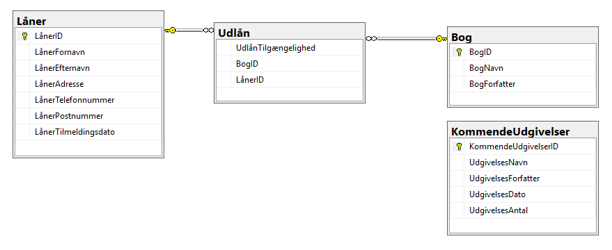

# :books: Biblioteket

### :books: Dokumentation for ER-diagram/planlægning af case.

Vi har valgt at oprette 4 tabeller, hvor 3 af dem har forbindelse til hinanden. Den sidste tabel står for sig selv som og den viser kommende udgivelse af bøger.

Vi har vores første tabel: Låner, som har alt information omkring lånerne. dernest har vi en tabel som hedder: Udlån, Som båder tager fat i Låner tabellen og den sidste tabel: Bog, og giver information om hvilken bog og hvem der har lånt den. I bog tabellen er alt information om bøger i bibloteket. 
Som sidst nævte tabel har vi KommendeUdgivelser, som kan vise alle kommende bøger, med navn, forfatter, udgivelses dato og hvor mange antal der er bestilt hjem af bogen. 

