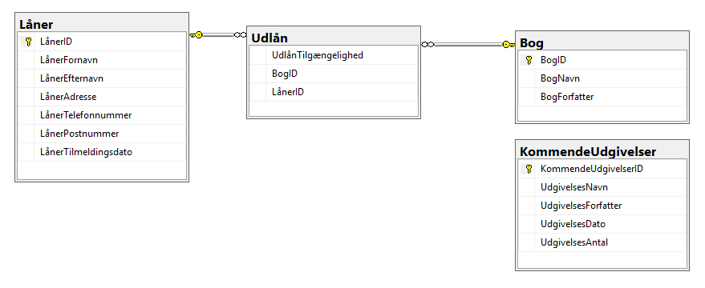

# :books: Biblioteket

### :blue_book: Dokumentation for bibliotekets database.


I denne opgave har vi valgt at oprette 4 tabeller, hvor 3 af dem har forbindelse til hinanden. Den sidste tabel står for sig selv og den indeholder kommende udgivelse af bøger.

:student: "Låner" som vi har valgt at kalde vores første tabel, indeholder al information omkring lånerne på Biblioteket.
```sql
CREATE TABLE Låner ( 
LånerID int IDENTITY (1,1) PRIMARY KEY, 
LånerFornavn varchar(55) NOT NULL, 
LånerEfternavn varchar(55) NOT NULL, 
LånerAdresse varchar(55) NOT NULL, 
LånerTelefonnummer int NOT NULL, 
LånerPostnummer int NOT NULL, 
LånerTilmeldingsdato varchar(55) NOT NULL, 
); 
```

:technologist: Dernest har vi en tabel som hedder "Udlån".
```sql
CREATE TABLE Udlån (
UdlånTilgængelighed int NOT NULL,
BogID int FOREIGN KEY REFERENCES Bog(BogID),
LånerID INT FOREIGN KEY REFERENCES Låner(LånerID)
);
```

:orange_book: Tabellen "Udlån" har forbindelse med "Låner" tabellen. "Bog" tabellen indeholder information omkring bøger.
```sql
CREATE TABLE Bog ( 
BogID int IDENTITY (1,1) PRIMARY KEY, 
BogNavn varchar(55) NOT NULL, 
BogForfatter varchar(55) NOT NULL,
); 
```

:notebook: Den sidste tabel vi har er "KommendeUdgivelser", som viser alle kommende bøger. Rækker i tabellen "KommendeUdgivelser" består af navn, forfatter, udgivelses dato og hvor mange antal der er bestilt hjem af bogen.
```sql
CREATE TABLE KommendeUdgivelser  (
KommendeUdgivelserID int IDENTITY (1,1) PRIMARY KEY,
UdgivelsesNavn varchar (55) NOT NULL,
UdgivelsesForfatter varchar (55) NOT NULL,
UdgivelsesDato varchar (55) NOT NULL,
UdgivelsesAntal int
);
```

:link: Entity-Relationship-Diagram


For at indkorporere 1. normalisering så har vi benyttet os af primary og foreign keys. F.eks. har vores Låner tabel et LånerID som er en unik værdi for hver låner der er indskrevet i biblioteket. Dette ID har vi taget med over i vores Udlåns tabel som fortæller os hvilke bøger der er ledige til udlån, og hvis de er udlånt hvilken låner der har bogen. På denne måde sikre vi os at vi ikke gentager attributter fordi LånerID både vil give mening i Låner og Udlån tabellen.


:capital_abcd: Se [Biblioteket.sql](https://github.com/Mads80/MS-SQL-HF2/blob/main/Biblioteket.sql) for den fulde SQL-kode og kommentarer.
